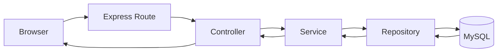

# アーキテクチャ概要

## 1. レイヤ構成

| レイヤ | 主要ディレクトリ | 役割 |
|---|---|---|
| Frontend | `app/public` | HTML/CSS/JSでUI描画・入力処理・API呼び出し |
| API Routing | `app/server/routes` | URLとHTTPメソッドのマッピング |
| Controller | `app/server/controllers` | リクエスト受理、Service呼び出し、レスポンス返却 |
| Service | `app/server/services` | 業務ロジック・複数リポジトリの調停 |
| Repository | `app/server/repositories` | SQL実行とDBアクセス |
| DB | `db/*.sql` | スキーマと初期データ |

## 2. リクエスト処理フロー



## 3. 認証・セッション方式

- セッションはサーバメモリ内 `Map` で管理
- Cookie名は `sid`
- Cookie属性: `HttpOnly`, `SameSite=Lax`, `Path=/`
- API保護方針
  - 認証不要: `/api/auth/login`, `/api/auth/logout`
  - 認証必須: その他 `/api/*`
- ページ保護方針
  - 未ログインで `.html` へアクセスした場合、`/login.html` へリダイレクト

## 4. フロントエンド構成（主要）

| ファイル | 役割 |
|---|---|
| `assets/js/api.js` | APIクライアント共通処理 |
| `assets/js/index.js` | 週間表示、画面遷移導線、グループ切替 |
| `assets/js/schedule_add.js` | 新規作成フォーム制御 |
| `assets/js/schedule_edit.js` | 編集・削除モーダル制御 |
| `assets/js/schedule_common.js` | 時刻/参加者/定期予約の共通ロジック |

## 5. 依存関係と起動

```bash
cd scheduleWebApp/app
npm install
npm start      # 本番相当
npm run dev    # nodemon利用
```

> NOTE: `npm test` は現状ダミー定義（テスト未整備）です。
